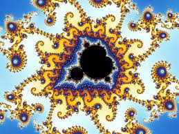

# The Mandelbrot Set
## Background 

The Mandelbrot set is a special set of complex numbers that gained popularity because of the beautiful fractal images it produces. You can find many videos online of infinite Mandelbrot zooms with lively colours. Today we'll be creating our own Mandelbrot zoom. 

<center></center>

The Mandelbrot set is the set of complex numbers c for which the following function, f~c~(z) = z^2^ + c does not diverge when iterated from z = 0. 

We see two cases with this function,
1. The value gets arbitarily large
2. The value is bounded by 2

Lets look at examples of both of these cases.

1. c = 1

    f~1~(0) = 0^2^ + 1 = 1

    f~1~(1) = 1^2^ + 1 = 2

    f~1~(2) = 2^2^ + 1 = 5

    f~1~(5) = 5^2^ + 1 = 26

We see here that the values blow up past 2 and so c = 1 is **not** in the Mandelbrot set.

2. c = -1 

    f~-1~(0) = 0^2^ + (-1) = -1

    f~-1~(-1) = -1^2^ + (-1) = 0

    f~-1~(0) = 0^2^ + (-1) = -1

    f~-1~(-1) = -1^2^ + (-1) = 0

   We can see this will continue to repeat and will never blow up past 2, so c = -1 is in the Mandelbrot set.

Now that we've understood what the Mandelbrot set is, lets start creating our own Mandelbrot set zoom on DCP.

** give general description of how the code will work **

## Prep Installation
Before we begin coding we'll need to set up our work space.
1. Download VS Code 

[VS Code](https://code.visualstudio.com/download)
1. Install npm
2. Install node

[npm and node](https://nodejs.org/en/download/) 

In terminal

1. Install sharp

`npm install sharp`

5. Install png-file-stream

`npm install png-file-stream`

6. Install gif encoder

`npm install gifencoder`

7. Install fs

`npm install fs`

8. Set up DCP

[DCP](dcp-set-up.md)

## Setting up VS Code
In VS Code navigate to the top left corner to the two overlapping files. Click on those files and create a new folder called "mandelbrot-set". Then create three files, main.js, image-animation.js and  mandelbrot-set.js. Finally, make another folder called "mandelbrot_images". 

Now we're ready to start coding!

## main.js set up

We're gonna start off by setting some variables that we'll need.

First we'll set up our boundary points for the axes we'll be plotting on. We'll be using the traditional boundaries used when plotting the Mandelbrot set where the x-axis is real numbers and the y-axis is imaginary numbers. 

Open your main.js and copy the following code.
```javascript
async function main() {
    let complex_coordinates = {
        x1: -2.5,
        y1: -1,
        x2: 1,
        y2: 1
    }

```
    
Next we'll set up the size of our canvas we'll plot on.
```javascript
const canvas_size = {
        height: 800,
        width: 1200
    }
```
    
We'll also set up the point we'll zoom to, our speed of zoom, the maximum number of iterations through our function f~c~(z), the number of frames we want to produce and how many frames each slice will make.
```javascript
const z0 = { re: 0.42884, im: -0.231345 };
const speed = 0.4;
const max_iterations = 1000;
const frames_num = 25;
const frames_per_worker = 3;
}
```

## mandelbrot-set.js
Next open the mandelbrot-set.js file in VS Code. 

### calculate escape time
First we're going to write our function that will actually calcualte which points are in the Mandelbrot set and which are not. Copy the following code.
```javascript
/**
 * Determines how many iterations of the function fc(z) before the point escapes
 * @param {int} z 
 * @param {int} max_iterations 
 * @returns k
 */
function calculate_escape_time(z, max_iterations) {
    c = z;
    var k = 0;
    while (k < max_iterations) {
        real = z.re * z.re - z.im * z.im + c.re;
        imaginary = 2 * z.re * z.im + c.im;
        z = { re: real, im: imaginary }

        if (z.re * z.re + z.im * z.im >= 4) {
            break;
        }
        k++;
    }
    return k;
}
```

### complex coordinates to feature
Next, we're going to create a function called complex coordiantes to feature, copy the following code to your mandelbrot-set.js file.  
```javascript
/**
 * Calculates the deltas needed to convert a point on the canvas to a point on the real and imaginary axes being plotted on.
 * @param {int} complex_coordinates 
 * @param {int} canvas_size
 * @returns x1
 * @returns y1
 * @returns delta_x
 * @returns delta_y
 */
function complex_coordinates_to_features(complex_coordinates, canvas_size) {
    let delta_x = (complex_coordinates.x2 - complex_coordinates.x1) / canvas_size.width
    let delta_y = (complex_coordinates.y2 - complex_coordinates.y1) / canvas_size.height

    let x1 = complex_coordinates.x1
    let y1 = complex_coordinates.y1

    return {
        x1: x1,
        y1: y1,
        delta_x: delta_x,
        delta_y: delta_y
    }
    

}
```
### coordinates to complex
Next we're going to create a function called coordinates to complex, copy the following code to your mandelbrot-set.js file.  

```javascript
/**
 * Translates any point on the canvas to a point on the real and imaginary axes. Takes in a point x, y on the canvas and the lower left deltas that were calcualted. It will then return the real and imaginary components of the point.
 * @param {int} x
 * @param {int} y
 * @param {int} lower_left_deltas
 * @returns re
 * @returns im
 */
function coordinates_to_complex(x, y, lower_left_deltas) {
    let re = lower_left_deltas.x1 + x * lower_left_deltas.delta_x
    let im = lower_left_deltas.y1 + y * lower_left_deltas.delta_y


    return {
        re: re,
        im: im
    }
}
```


### make frame
Copy the following code.
```javascript
/**
 * Creates a matrix for every frame which will contain the escape time of every point in the frame. That current escape time will then be replaced with the colour of the specific point. This is also where progress will be called which is needed to run on DCP.
 * @param {int} canvas_size
 * @param {int} complex_coordinates 
 * @param {int} max_iterations 
 * @returns frame
 */
function make_frame(canvas_size, complex_coordinates, max_iterations) {
    const rows = canvas_size.height
    const cols = canvas_size.width
    let frame = Array.from({ length: rows }, () =>
        Array.from({ length: cols }, () => [0, 0, 0])
    );

    let lower_left_deltas = complex_coordinates_to_features(complex_coordinates, canvas_size)

    for (let y = 0; y < rows; y++) {
        for (let x = 0; x < cols; x++) {
            let z = coordinates_to_complex(x, y, lower_left_deltas);
            let current_escape_time = calculate_escape_time(z, max_iterations) / max_iterations;
            frame[y][x] = escape_time_to_colour(current_escape_time, max_iterations);
        }
        progress();
    }
    return frame
}
```

### make frames
Copy the following code.
```javascript
/**
 * For every frame each worker will calculate the complex coordinates for that frame and then make that frame by calling the make_frame function. Frames will be an array of matrices where each entry of the matrix is the color of the point. 
 * @param {int} canvas_size 
 * @param {int} max_iterations 
 * @param {int} first_complex_coordinates 
 * @param {int} last_complex_coordinates 
 * @param {int} total_frames 
 * @returns frames
 */
function make_frames(canvas_size, max_iterations, first_complex_coordinates, last_complex_coordinates, total_frames) {
    frames = []

    for (let k = 0; k < total_frames; k++) {

        let current_complex_coordinates = kth_complex_coordinate(first_complex_coordinates, last_complex_coordinates, total_frames, k)
        let current_frame = make_frame(canvas_size, current_complex_coordinates, max_iterations)
        frames.push(current_frame)
    }
    return frames
}
```
### kth complex coordinate
Copy the following code.
```javascript
/**
 * Calculates the new complex coordinates for each frame per slice.
 * @param {int} first_complex_coordinates 
 * @param {int} last_complex_coordiantes 
 * @param {int} total_frames 
 * @param {int} k 
 * @returns x1
 * @returns x2
 * @returns y1
 * @returns y2
 */
function kth_complex_coordinate(first_complex_coordinates, last_complex_coordinates, total_frames, k) {
    let alpha = k / total_frames
    let x1 = (1 - alpha) * first_complex_coordinates.x1 + alpha * last_complex_coordinates.x1;
    let x2 = (1 - alpha) * first_complex_coordinates.x2 + alpha * last_complex_coordinates.x2;
    let y1 = (1 - alpha) * first_complex_coordinates.y1 + alpha * last_complex_coordinates.y1;
    let y2 = (1 - alpha) * first_complex_coordinates.y2 + alpha * last_complex_coordinates.y2;
    return {
        x1: x1,
        x2: x2,
        y1: y1,
        y2: y2        
    }
}
```


### escape time to colour
Copy the following code.
```javascript
/**
 * Translates an escape time to an array of three values that will determine the colour of that point. The colour of the points will be determined by how many iterations it took before the point escaped.
 * @param {*} current_escape_time
 * @returns colour
 */
function escape_time_to_colour(current_escape_time) {

    let R = Math.floor(255 * Math.log10(current_escape_time) );
    let B = Math.floor(255 * (Math.pow(current_escape_time, 0.2)));
    let G = Math.floor(255 * 3 * (current_escape_time * (1 - current_escape_time) + 0.25 * current_escape_time));

    return [R,G,B]
}

```
### zoom in
Lastly, we need to create our zoom in function. Copy the following code.
```javascript
/**
 * Creates new axes boundaries based off of the speed and the point it's zooming towards.
 * @param {int} complex_coordinates
 * @param {int} z0
 * @param {int} speed
 * @returns x1
 * @returns x2
 * @returns y1
 * @returns y2
 */

function zoom_in(complex_coordinates, z0, speed) {
    let x1 = complex_coordinates.x1 * (1 - speed) + z0.re * speed;
    let x2 = complex_coordinates.x2 * (1 - speed) + z0.re * speed;
    let y1 = complex_coordinates.y1 * (1 - speed) + z0.im * speed;
    let y2 = complex_coordinates.y2 * (1 - speed) + z0.im * speed;

    return {
        x1: x1,
        x2: x2,
        y1: y1,
        y2: y2
    }

}
```
### module export
In the last line of this file we'll export the functions we'll need in the main.js file.
```javascript
module.exports = { make_frames, zoom_in }
```

Now our mandelbrot-set.js file is complete. 

## image-animation.js
Next we're going to open the image-animation.js file. 

### requirements
Copy the following requirements needed for saving the images and gif. 
```javascript
const sharp = require('sharp');
const pngFileStream = require('png-file-stream');
const GIFEncoder = require('gifencoder');
const fs = require('fs');
```

### save image
Copy the following code to save the images.
```javascript
/**
 * take in the frame which is a Uint8 array and saves each frame as a png.
 * @param {int} frame
 * @param {int} width
 * @param {int} height
 * @param {string} folder
 * @param {string} name
 * @returns image
 */
async function save_image(frame, width, height, folder, name) {
  image = sharp(frame, {
    raw: {
      width: width,
      height: height,
      channels: 3
    }

  });
  await image.toFile(folder + name)
  return image
}
```

### create gif
Copy the following code to create the gif.
```javascript
/**
 * Take the pngs created and turns them into a gif.
 * @param {int} width
 * @param {int} height
 * @param {string} folder
 * @param {string} name
 */
async function create_gif(width, height, folder, name) {
  const encoder = new GIFEncoder(width, height);
  const image_names = folder + name + '*.png'
  const stream = pngFileStream(folder + name + '*.png')
    .pipe(encoder.createWriteStream({ repeat: 0, delay: 500, quality: 10 }))
    .pipe(fs.createWriteStream(folder + name + '.gif'));

  await new Promise((resolve, reject) => {
    stream.on('finish', resolve);
    stream.on('error', reject);
  });
}
```

### module export
Again the last line will be exporting both of these functions so that we can use them in main.js.
```javascript
module.exports = { save_image, create_gif }
```

## main.js
Finally, we're going back to our main.js file and tie everything together.

### description
You'll first add a description and credits.
```javascript
#!/usr/bin/env node
/**
 * @file        main.js
 *              Application which will allow the user to zoom into the Mandelbrot set. The user will 
 *              input a starting point and end point to zoom too. The application will save a video of the zoom.
 * 
 * @author      Ellie Mehltretter, ellie@kingsds.network
 * @date        July 2021
 */
```
### requirements
Next we'll add the requirements for the files we'll need, this will be our mandelbrot-set.js file and image-animation.js file. As well as the DCP scheduler. 
```javascript
const mandelbrot = require("./mandelbrot-set.js");
const create_image = require("./image-animation.js");

const SCHEDULER_URL = new URL('https://scheduler.distributed.computer');
```
### main
Then we'll slightly alter what we added to main.js earlier by adding more to our main function. 

In our main function we'll create an array the same size as the number of frames we have. Each entry in the array will be the plots boundary points for each new frame after zooming.
```javascript
    let complex_coordinates_new;
    let pre_frames = new Array(frames_num)
    for (let i = 0; i < frames_num; i++) {
        complex_coordinates_new = mandelbrot.zoom_in(complex_coordinates, z0, speed);
        pre_frames[i] = [complex_coordinates, complex_coordinates_new];
        complex_coordinates = complex_coordinates_new;
    }
```
We're going to then require the DCP compute and wallet which are needed to run DCP. The code following is what allows us to run our program on DCP. We do have the option to switch between running on DCP or our own computer by changing the value of the variable do it on dcp. If it is set to true we'll run our program on DCP, false and we'll run it on our own computers. You'll need to remember to comment or uncomment that line `progress()` in the mandelbrot-set.js file in function make_frame though. 
```javascript
    const compute = require('dcp/compute');
    const wallet = require('dcp/wallet');
    let startTime;

    let do_it_on_dcp = true;
    let array_results = Array();
    if (do_it_on_dcp) {

        const job = compute.for(
            pre_frames,
            (pre_frame, canvas_size, max_iterations, frames_per_worker) => {
                const mandelbrot = require("./mandelbrot-set")
                const frames = mandelbrot.make_frames(canvas_size, max_iterations, pre_frame[0], pre_frame[1], frames_per_worker);
                return frames;
            }, [canvas_size, max_iterations, frames_per_worker]
        );


        job.requires("./mandelbrot-set")

        job.on('accepted', () => {
            console.log(` - Job accepted by scheduler, waiting for results`);
            console.log(` - Job has id ${job.id}`);
            startTime = Date.now();
        });

        job.on('readystatechange', (arg) => {
            console.log(`new ready state: ${arg}`);
        });

        job.on('result', (ev) => {
            console.log(
                ` - Received result for slice ${ev.sliceNumber} at ${Math.round((Date.now() - startTime) / 100) / 10
                }s`,
            );
        });
        job.on('status', (ev) => {
            console.log('Got status update: ', ev)
        })

        job.public.name = 'mandelbrot set, nodejs';

        job.computeGroups = [{ joinKey: "aitf", joinSecret: "9YDEXdihud" }]
        const ks = await wallet.get(); /* usually loads ~/.dcp/default.keystore */
        job.setPaymentAccountKeystore(ks);
        const results = await job.exec(); //compute.marketValue
        //console.log('results=', Array.from(results));
        array_results = Array.from(results);
        debugger;
    } else {

        for (let idx = 0; idx < pre_frames.length - 1; idx++) {
            const frames = mandelbrot.make_frames(canvas_size, max_iterations, pre_frames[idx][0], pre_frames[idx][1], frames_per_worker);
            array_results.push(frames);
        }
    }

    for (let i = 0; i < array_results.length; i++) {
        for (let j = 0; j < array_results[i].length; j++) {
            let idx = i * array_results.length + j
            let image = Uint8Array.from(array_results[i][j].flat(3))
            create_image.save_image(image, canvas_size.width, canvas_size.height, "./mandelbrot_images", "/mandelbrot" + String(idx).padStart(3, "0") + '.png')
        }
    }

    create_image.create_gif(canvas_size.width, canvas_size.height, './mandelbrot_images', '/mandelbrot')

}
```
You can see in that last for loop we're saying for each of our results we're getting back, which will be the array of colours for each point, turn that into a Uint8Array. Then create png files in our mandelbrot image folder with the file name mandelbrot[x].png. We then create a gif and send it to our mandelbrot image folder with the name mandelbrot.gif.

### initialize DCP
```javascript
/* Initialize DCP Client and run main() */
require('dcp-client')
    .initSync(SCHEDULER_URL)
main()
```
Now we wait for our slices and then check our mandelbrot image folder for our gif!

<center></center>

## Next Steps

Thank you for following along and if you'd like to continue to play with the Mandelbrot set you can try zooming towards different points. In this tutorial we zoomed towards (0.42884, -0.231345) but there are many different interesting points to zoom to. You can also try changing the colouring of the image. 

<center></center>